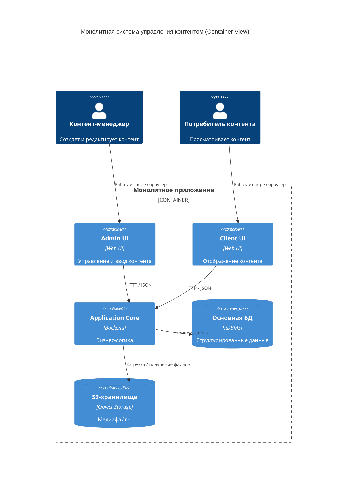
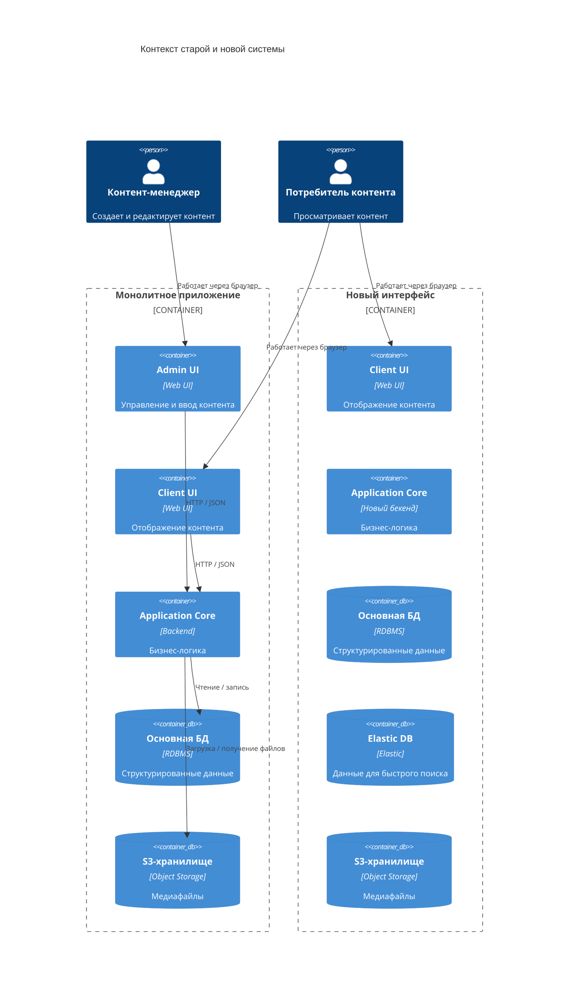
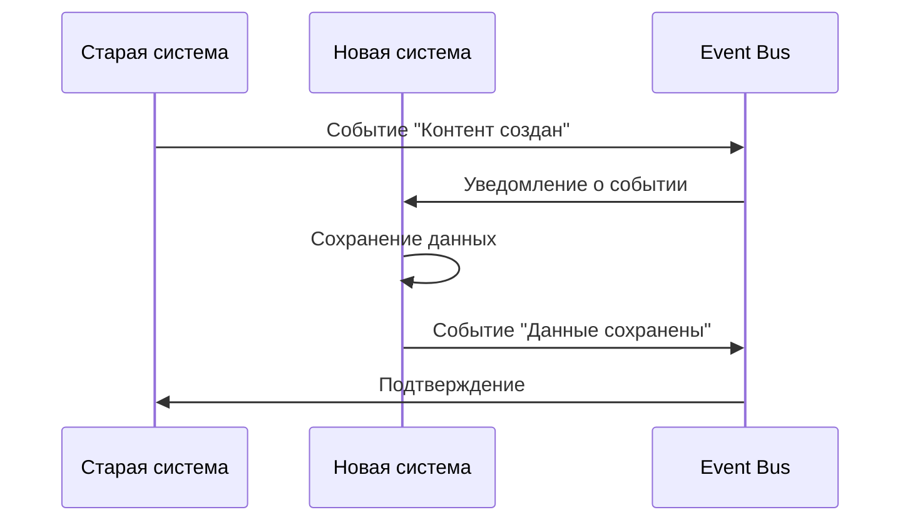
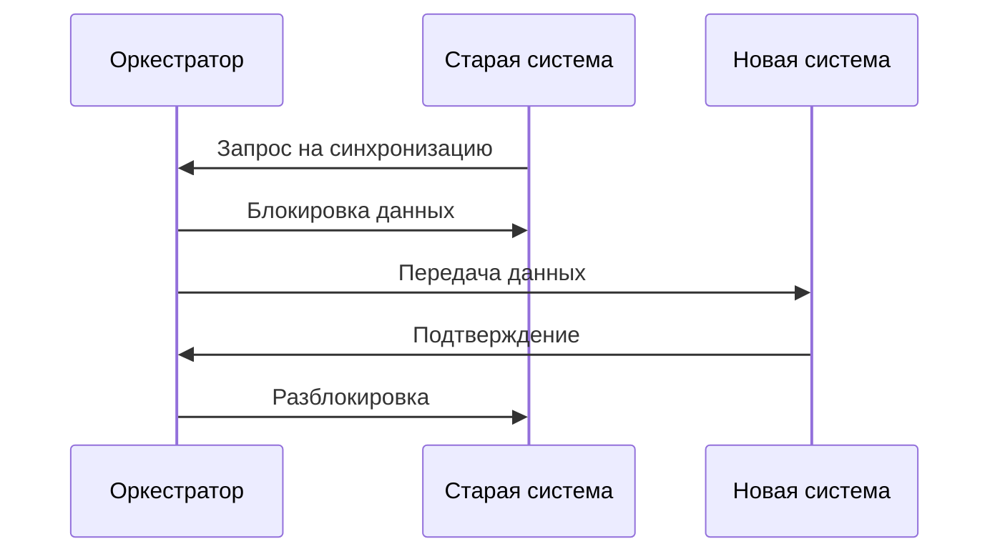
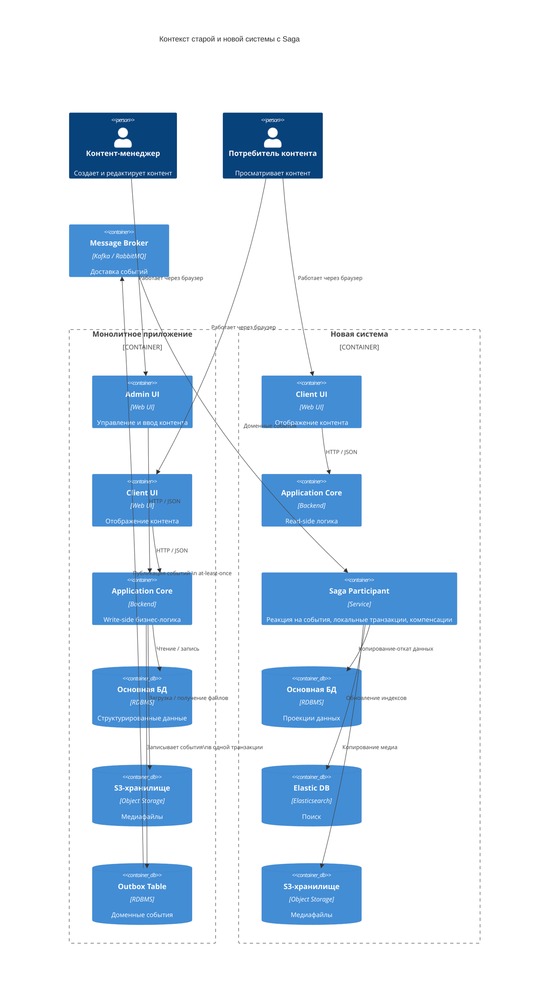
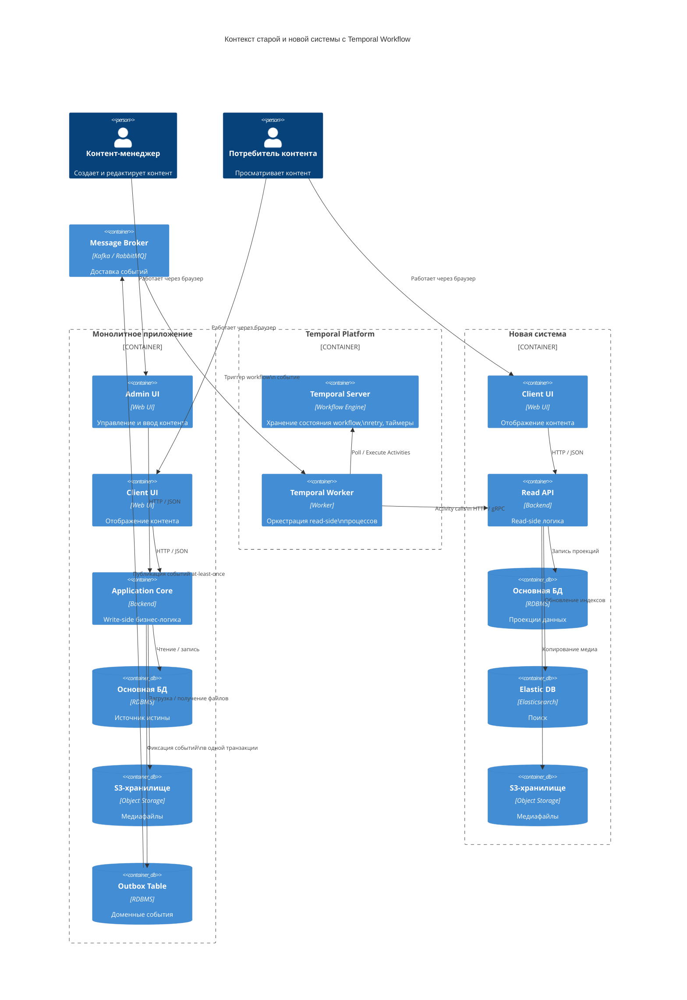
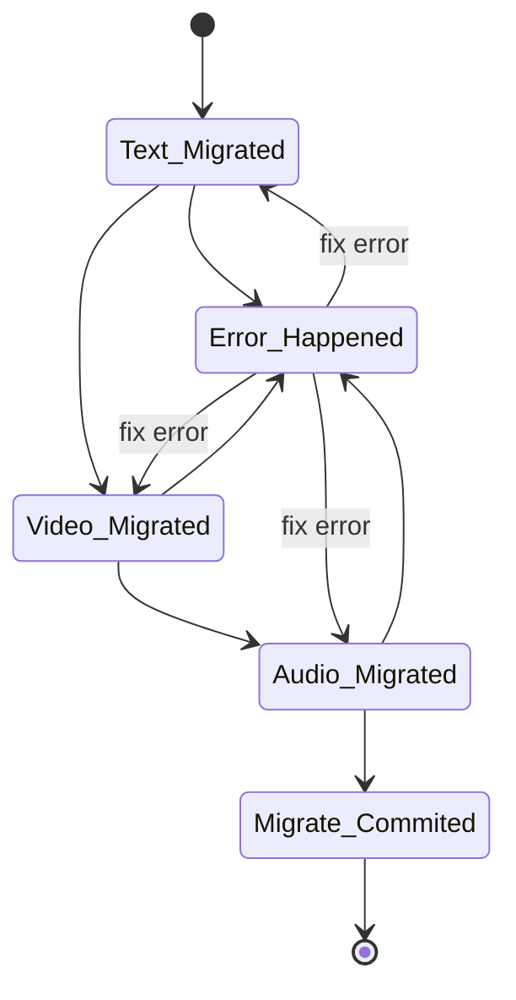
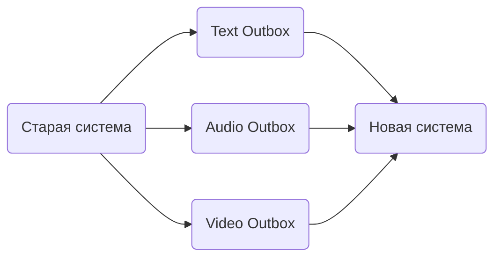
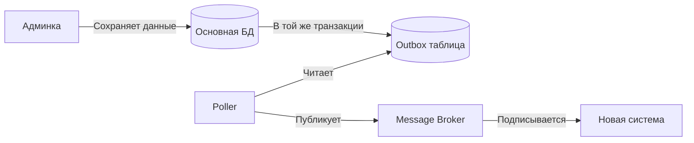
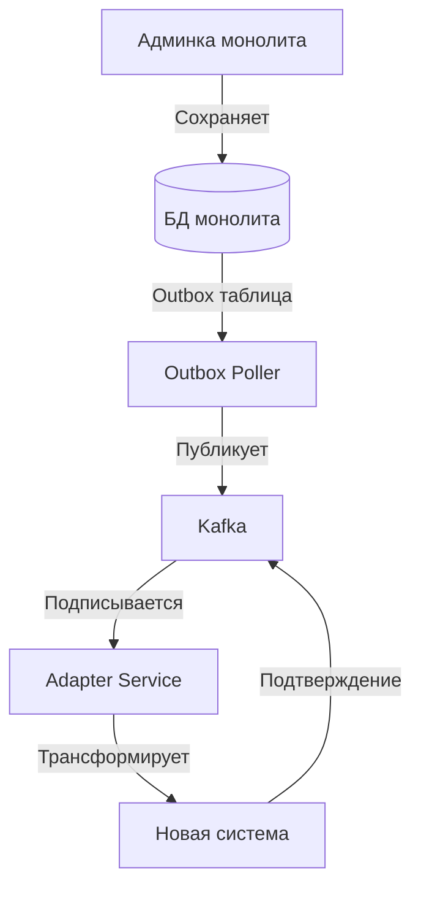

+++
date = '2026-01-12T01:25:27+03:00'
draft = false
title = 'Синхронизация данных при переходе с монолита на микросервисы'
+++

# Синхронизация данных при переходе с монолита на микросервисы

Недавно мне пришлось заниматься миграцией монолитной системы для управления медиаконтентом в микросервисную архитектуру. Причины перехода оставлю за скобками - это стандартная история про устаревший монолит, который сложно поддерживать и масштабировать. Сосредоточусь на технических аспектах.
В статье расскажу о решении одной из ключевых задач при переходе от монолита к микросервисам - синхронизации данных между старой и новой системами. 

## Описание исходной системы
Для начала определимся с терминологией. Под "старой системой" я имею в виду исходное монолитное приложение, под "новой системой" - новое микросервисное решение, к которому мы мигрируем.
На диаграмме ниже показана исходная архитектура:



Старая система представляла собой классический монолит: единое приложение, которое отвечало за ввод, хранение, обработку и отображение контента. Контент - это совокупность текста и медиаданных (звуковые файлы, видео файлы, картинки). 
Система была создана достаточно давно, архитектура и технологический стек морально устарели, что начало проявляться в  сложностях с сопровождением, масштабирование  и написанием новых фич. Также были сложности с  поиском специалистов, которые были бы готовы это приложение поддерживать. 

Функционально монолит представлял два основных интерфейса:
- **Административный интерфейс** - ввод и редактирование текстовых данных и медиаданных, с возможностью модерации и валидации;
- **Клиентский интерфейс** - отображение контента конечным пользователям, включая персонализацию и рекомендации.

## Постановка задачи

Бизнесу было важно получить результат в сжатые сроки, поэтому вариант "построить новую систему целиком и затем переключить трафик" не подходил. В таких случаях хорошо работает паттерн Strangler Fig, [описанный Мартином Фаулером](https://martinfowler.com/bliki/StranglerFigApplication.html): функциональность старой системы постепенно заменяется новой, работающей в реальных условиях.

Контент создавался исключительно через старую систему, и та же самая старая система предоставляла контент для чтения конечным пользователям. Для начала требовалось понять, а какую часть стоит заменить вначале, а что потом. С помощью [CQRS](https://habr.com/ru/companies/simbirsoft/articles/329970/) можно отделить код для создания контента от кода для его чтения. Соответственно, самый очевидный первый шаг - это логически декомпозировать монолит на **read-side** и **write-side**, соответственно. Так как бизнес ориентирован на пользователей, соответственно выгодно переходить на более современные технологии UI, очевидно, что первым шагом требуется переделать **read-side** часть. Это логично: читающая часть обычно проще, лучше масштабируется и менее чувствительна к временной неконсистентности. Пользователь может увидеть слегка устаревший контент, но это лучше, чем полный отказ.
В короткие сроки был создан новый UI, бекенд, подготовлены базы данных. Осталось решить проблему с передачей данных из старой системы в новую.
Это типичный сценарий эволюционной миграции: старая система продолжает обслуживать пользователей, параллельно разрабатывается новая, и между ними требуется надежная синхронизация данных.

**Ключевой вопрос** - как обеспечить эту синхронизацию без радикального переписывания legacy-кода в монолите и без потери данных.

На следующем этапе планировалась декомпозиция на микросервисы **write-side** - административной части и процессов создания контента. Рассказ про переделку **write-side** выходит за рамки статьи. Возможно в дальнейшем я напишу статью про переделку этой части приложения.

Ниже показан расширенный контекст системы, включающий старую и новую части. 


На диаграмме описаны две системы: старая и новая. Предполагалось, что старая система должна работать как и прежде, но при этом она должна каким-то образом отправлять данные в новую.
Вся задача сводится к консистентной и надежной передаче данных из одной системы в другую. Важно понимать, две вещи: вероятен **временной лаг** между созданием контента в админке и предоставлением его конечному пользователю, а также что админка в монолите должна являться **единственным источником истины**. Если контент-менеджеры начнут создавать или менять данные одновременно через старую и новую системы, возникнет рассинхронизация. В худшем случае это может привести к проблемам совместного редактирования (смотри [OT](https://habr.com/ru/articles/972638/) и [CRDT](https://loro.dev/docs/concepts/crdt)), так что лучше этого избегать.

Также хочу отметить, что механизм синхронизации, о котором пойдет речь в статье, учитывает только новые данные, которые создаются или редактируются через интерфейс админки старой системы. Задача **миграции исторических данных** - это отдельная тема, которая выходит за рамки этой статьи. Для исторических данных обычно используются батч-процессы, ETL-инструменты (например, Apache Airflow), с валидацией на консистентность перед переключением.

Не стоит забывать, что конечная цель - **переделка всей старой системы**, то есть после полного перевода на современную архитектуры всей системы, механизм синхронизации предполагается **деактивировать за ненадобностью**. 

Ниже представлены различные варианты реализации, как можно реализовать механизм синхронизации данных. Каждый из подходов имеет свои преимущества и недостатки, и выбор зависит от конкретных требований проекта:

- **Двухфазный коммит (2PC)** - классический подход для распределенных транзакций
- **Saga** - современный паттерн для длинных распределенных транзакций
- **Temporal Workflow** - специализированная платформа для управления бизнес-процессами
- **Оркестратор через Event Sourcing** - комбинация event-driven архитектуры и оркестрации
- **Outbox Pattern** - надежная доставка событий из монолита
- **Change Data Capture (CDC)** - автоматическое отслеживание изменений в БД

## Варианты реализации

Перед тем как перейти к описанию конкретных подходов, важно понять критерии выбора. Не существует универсального решения, которое подходит для всех случаев. Каждый проект имеет свои особенности, ограничения и требования.

Я сформулировал следующие вопросы, которые помогают выбрать правильный подход:

1. **Насколько быстро требуется передать данные конечному клиенту?**
   - Нужна ли синхронизация в реальном времени или допустима задержка в секунды/минуты?
2. **Какая допустимая задержка между системами?**
   - Синхронная передача (миллисекунды) или асинхронная (секунды/минуты)?
3. **Требуется ли строгая консистентность данных между системами?**
   - Должны ли данные в обеих системах быть идентичными в любой момент времени, или допустима eventual consistency?
4. **Какова допустимая сложность реализации?**
   - Есть ли время и ресурсы на сложные решения или нужен быстрый MVP?
5. **Какой объем данных передается?**
   - Малые порции данных или большие батчи? Влияет на выбор механизма передачи.
6. **Как часто происходят изменения?**
   - Постоянный поток событий или периодические обновления?
7. **Какая ожидается нагрузка?**
   - Низкая, средняя или высокая? Определяет требования к производительности решения.

Ниже я разберу каждый подход отдельно, чтобы понять, когда какой использовать.

### 1. Двухфазный коммит (2PC)

**Суть подхода:** Классический протокол распределенных транзакций, который гарантирует атомарность операций в нескольких системах. Это один из старейших подходов, описанный еще в 1970-х годах. Подробное описание можно найти [тут](https://martinfowler.com/articles/patterns-of-distributed-systems/two-phase-commit.html).

Хотя он устарел для большинства современных сценариев, он все еще применяется в нишевых случаях, таких как финансовые системы с поддержкой XA-стандарта.

**Как работает:**

Протокол состоит из двух фаз:

- **Фаза 1 (Prepare)**: Координатор запрашивает у всех участников готовность к коммиту. Каждый участник блокирует необходимые ресурсы и отвечает "готов" или "не готов". Важно понимать, что на этом этапе изменения еще не фиксируются, но ресурсы уже заблокированы.

- **Фаза 2 (Commit/Rollback)**: Если все участники ответили "готов", координатор отправляет команду на коммит. Если хотя бы один участник ответил "не готов" или произошел сбой, координатор отправляет команду на откат всех изменений.

Это гарантирует, что либо все системы обновятся одновременно, либо ни одна не изменится - классическая ACID транзакция, но распределенная.

**Плюсы:**
- **Строгая консистентность данных** - данные в обеих системах всегда синхронизированы, что критично для сценариев вроде банковских переводов.
- **Атомарность операций** - либо все успешно, либо ничего не изменилось.
- **Простая концепция для понимания** - логика интуитивно понятна для разработчиков с опытом работы с ACID транзакциями.

**Минусы:**
- **Блокировка ресурсов на время транзакции** - это главная проблема производительности. Пока транзакция не завершится, ресурсы заблокированы, что может привести к дедлокам и снижению пропускной способности системы.
- **Координатор - единая точка отказа** - если координатор упадет в неподходящий момент, транзакция может "зависнуть" в неопределенном состоянии. Требуется настройка высокой доступности.
- **Не подходит для высоконагруженных систем** - блокировки делают этот подход непригодным для систем с высокой нагрузкой.
- **Сложность отката при частичных сбоях** - если один из участников упал после фазы Prepare, нужно разбираться, что делать с остальными. Это требует ручного вмешательства или сложных механизмов восстановления.

**Когда использовать:**
- Когда критична строгая консистентность и нельзя допустить рассинхронизации данных даже на секунды.
- Низкая нагрузка на систему - когда транзакций немного и они короткие.
- Короткие транзакции - чем короче транзакция, тем меньше времени ресурсы заблокированы.

**Когда НЕ использовать:**
- В высоконагруженных системах.
- Когда транзакции могут быть долгими (более нескольких секунд).
- В микросервисной архитектуре с множеством сервисов, где предпочтительны асинхронные паттерны.

Честно говоря, в современных сложных и распределенных системах двухфазный коммит практически не используется, так что он приведен здесь скорее как исторический пример. 

### 2. Saga - распределенная транзакция
**Суть подхода:** Длинная транзакция разбивается на последовательность локальных транзакций, каждая из которых имеет компенсирующее действие (compensating transaction). Это современная альтернатива 2PC, которая решает проблему блокировок за счет ослабления требований к консистентности. Подробное описание можно найти [тут](https://habr.com/ru/articles/427705/).

Saga идеальна для микросервисов, где каждый сервис отвечает за свою часть процесса. Паттерн поддерживает два механизма работы:

- **Хореография** - когда каждый сервис понимает, что он должен делать в каждый момент времени.
- **Оркестрация** - когда присутствует центральный координатор, который управляет транзакциями.

Подробнее описано ниже. На практике Saga часто интегрируется с message broker'ами вроде Kafka для обеспечения доставки событий и мониторится через distributed tracing.

#### 2.1. Хореография

В этом подходе каждый сервис знает, что делать дальше и публикует события для следующих шагов. Преимущество этого подхода в том, что нет центрального координатора, что делает систему более отказоустойчивой. Недостаток - сложнее отслеживать общий поток выполнения и отлаживать проблемы. Для SRE это означает необходимость в хорошем логировании и correlation ID для трассировки.

Упрощенная диаграмма последовательности представлена ниже:


#### 2.2. Оркестрация

В отличие от хореографии, здесь есть центральный оркестратор, который управляет последовательностью шагов. Мы добавляем в схему единую точку отказа, но в ответ получаем контроль за всем процессом миграции.
Преимущество - централизованное управление и сравнительная простота в  отслеживании состояния всего процесса.



На диаграмме ниже представлен вариант реализации подобной архитектуры.


**Плюсы:**
- **Высокая производительность** - нет долгих блокировок, каждая транзакция локальна и быстра (latency <1sec per step).
- **Отказоустойчивость** - если один шаг упал, можно выполнить компенсирующую транзакцию для предыдущих шагов; интегрируйте с circuit breakers (Hystrix/Resilience4j).
- **Масштабируемость** - каждый сервис может масштабироваться независимо, с backpressure для обработки пиков.
- **Подходит для микросервисов** - это один из стандартных паттернов для микросервисной архитектуры, с поддержкой в фреймворках вроде Spring Boot.

**Минусы:**
- **Сложность реализации компенсирующих транзакций** - нужно продумать, как реализовать откат каждого шага (например, для необратимых действий вроде email - использовать "undo" или лог). 
- **Eventual consistency** - данные могут быть несинхронизированы некоторое время. Это фундаментальный компромисс этого подхода, с возможной сильной консистентностью в ключевых шагах.
- **Сложность отладки распределенных транзакций** - когда что-то пошло не так, нужно собирать логи из разных сервисов; используйте ELK stack.
- **Нужна инфраструктура для событий** - требуется message broker (Kafka, RabbitMQ и т.д.), с cost of ownership (maintenance, partitioning).

**Когда использовать:**
- Длинные бизнес-процессы - когда транзакция может занимать минуты или даже часы (например, обработка видео).
- Высокая нагрузка - когда нужно обрабатывать много транзакций параллельно.
- Готова принять eventual consistency - когда допустимо, что данные будут синхронизированы не мгновенно, а через некоторое время.

**Когда НЕ использовать:**
- Когда требуется строгая консистентность в реальном времени.
- Когда компенсирующие транзакции слишком сложны или невозможны (например, для внешних API).

### 3. Temporal Workflow
**Суть подхода:** Использование специализированной [платформы](https://temporal.io/) для управления долгоживущими бизнес-процессами с гарантиями выполнения. Temporal - это open-source платформа, созданная бывшими инженерами Uber, которая решает проблему надежного выполнения распределенных бизнес-процессов. Она обеспечивает детерминизм: workflow-код выполняется как последовательность шагов, где состояние сохраняется в durable storage (Cassandra или PostgreSQL), позволяя восстановление после сбоев.



**Как работает:**
- **Workflow описывает бизнес-логику как код** - пишется код, который описывает последовательность шагов. Temporal обеспечивает запуск этого кода на worker'ах.
- **Temporal гарантирует выполнение workflow даже при сбоях** - если сервис упал, Temporal восстановит выполнение с последней успешной точки. Это достигается за счет того, что каждое действие workflow детерминировано и может быть воспроизведено из event history. Например, если шаг "мигрировать видео" прерван, Temporal replay'нет историю и продолжит.
- **Автоматические retry и таймауты** - можно настроить политики повторных попыток (exponential backoff) и таймауты для каждого шага workflow. Для медиа - retry для загрузки файлов с лимитом 5 попыток.
- **Визуализация выполнения workflow** - Temporal предоставляет UI, где можно видеть состояние всех запущенных workflow, их историю выполнения и отлаживать проблемы. Интеграция с Prometheus для метрик (completion rate, latency percentiles).

**Плюсы:**
- гарантия доставки - **at-least-once** с автоматическим recovery.
- Простота написания бизнес-логики.
- Встроенные механизмы ретраев и таймаутов.
- UI для мониторинга.
- Поддержка долгоживущих процессов (дни, недели).

**Минусы:**
- Дополнительная инфраструктура.
- Может быть избыточно для простых случаев.

**Когда использовать:**
- Сложные долгоживущие бизнес-процессы - миграция медиа с несколькими шагами (текст, видео, аудио).
- Критична надежность выполнения - когда сбои недопустимы.
- Нужна хорошая наблюдаемость - для команд SRE с фокусом на мониторинг.

### 4. Event Sourcing

**Суть подхода:** Комбинация паттерна **Event Sourcing** (хранение событий вместо состояния) и оркестратора для управления синхронизацией. Это более сложный, но мощный подход, который дает полную историю всех изменений в системе. **Event Sourcing** интегрируется с оркестратором (например, Conductor от Netflix) для координации.

**Как работает:**
**Event Sourcing** - это паттерн, при котором вместо хранения текущего состояния объекта мы храним последовательность событий, которые привели к этому состоянию. Текущее состояние можно восстановить, "проиграв" все события с начала. Это дает множество преимуществ: полный аудит, возможность "перемотать" время назад, создание новых представлений данных и т.д. Для оптимизации используйте snapshots - периодические дампы состояния, чтобы избежать полного replay (например, snapshot каждые 100 событий).

Опишем объект, который хотим мигрировать из старой системы в новую, как конечный автомат (**FSM** - Finite State Machine). **FSM** может быть расширен параллельными ветками, например, для одновременной миграции текста и видео.

Это только один из вариантов **FSM**, который можно реализовать. 

Более подробно про реализацию **Event Sourcing** можно почитать [тут](https://victoramartinez.com/posts/event-sourcing-in-go/). Особенность Event Sourcing заключается в том, что последний актуальный контекст можно всегда восстановить по записанным в базу событиям.

**Плюсы:**
- Всегда есть возможность посмотреть полную историю изменений
- Возможность восстановления состояния - полезно для дебага.
- Cервисы реагируют на события независимо.

**Минусы:**
- Сложность реализации - надо перестроиться от хранения конечного состояния в базе к хранению последовательности событий.
- Требуется хранилище для событий - большой оверхед память для хранения данных.

**Когда использовать:**
- Нужна полная история изменений.
- Если требуется использовать **FSM** (например область интернет платежей)
- Требуется возможность восстановления состояния
- Критичен аудит

### 5. Outbox Pattern
**Суть подхода:** Паттерн для надежной доставки событий из монолита без изменения основной логики. Это один из самых популярных паттернов для обеспечения межсервисного взаимодействия, потому что он требует минимальных изменений в существующем коде. Для медиа - отдельные outbox'ы для типов данных.

Что если мы параллельно будем отправлять данные, используя outbox паттерн? Это позволит гарантировать доставку событий, не нарушая работу существующей системы.



Достаточно простая архитектура взаимодействия. Использование паттерна дает гарантию **at-least-once**, что означает, что событие точно будет доставлено, но может быть доставлено несколько раз. Это можно обработать и дедуплицировать на принимающей стороне, используя идемпотентные ключи.
В моей голове гарантия **at-least-once** лучше, чем **at-most-once** , потому что потеря события хуже, чем его дублирование. Дублирование можно обработать и дедуплицировать, а потерянное событие может привести к рассинхронизации данных.

**Как работает:**

Механизм работы прост и элегантен:
- **При сохранении данных в БД, также сохраняется событие в таблицу Outbox в той же транзакции** - это ключевой момент! Благодаря тому, что запись в Outbox происходит в той же транзакции, что и основная запись, мы гарантируем, что если данные сохранены, то событие о них тоже сохранено. Это решает проблему потери событий при сбоях. Структура таблицы: id, event_type, payload, created_at, processed_at.
- **Отдельный процесс (poller) читает из Outbox и публикует события** - фоновый процесс периодически опрашивает таблицу Outbox, находит необработанные события и публикует их в message broker (Kafka, RabbitMQ и т.д.). Этот процесс может быть отдельным сервисом или частью монолита. Интервал polling: 1-5sec, с lock'ами для concurrency.
- **После успешной публикации событие помечается как обработанное** - только после того, как событие успешно опубликовано в message broker, оно помечается как обработанное. Если публикация не удалась, событие останется в Outbox и будет обработано при следующем опросе. Для cleanup - cron-job удаляет старые записи.



**Плюсы:**
- **Гарантия доставки (транзакционность)** - благодаря использованию транзакций БД, мы гарантируем, что событие не потеряется (reliability >99.99%).
- **Минимальные изменения в монолите** - нужно только добавить запись в таблицу Outbox при сохранении данных. Остальная логика не меняется.
- **Надежность** - даже если poller упал, события останутся в Outbox и будут обработаны после перезапуска; интегрируйте с Kubernetes для auto-restart.
- **Простота понимания** - концепция интуитивно понятна, не требует глубокого понимания сложных паттернов.

**Минусы:**
- **Дополнительная таблица в БД** - нужно создать и поддерживать таблицу Outbox, но это небольшая цена за надежность (indexing на processed_at).
- **Нужен отдельный воркер для поллинга outbox таблички** - требуется отдельный процесс, который будет опрашивать Outbox. Это может быть узким местом при высокой нагрузке, но можно масштабировать, запуская несколько экземпляров poller'а.
- **Eventual consistency** - ну а как же без него. События обрабатываются асинхронно, поэтому данные в новой системе появятся с небольшой задержкой.

**Когда использовать:**
- **Минимальные изменения в монолите** - когда нельзя или нежелательно сильно менять существующий код.
- **Нужна гарантия доставки** - когда потеря события недопустима.
- **Простая интеграция** - когда нужен быстрый и надежный способ интеграции без сложной инфраструктуры.

**Когда НЕ использовать:**
- Когда нужна синхронизация в реальном времени (миллисекунды).
- Когда нет возможности добавить таблицу в БД монолита.

### 6. Change Data Capture (CDC)
Так как я вначале описал 2pc подход, стоит еще рассказать про CDC-подход, когда с помощью базы данных мы отслеживаем изменения и автоматически синхронизируем.

**Суть подхода:** Отслеживание изменений в БД монолита и автоматическая синхронизация с новой системой. Это подход "нулевого кода" - не нужно менять код монолита вообще, достаточно иметь доступ к базе данных. CDC работает на уровне базы данных, отслеживая изменения в transaction log (WAL - Write-Ahead Log). Каждая СУБД ведет лог всех изменений для целей репликации и восстановления. CDC инструменты читают этот лог и преобразуют изменения в события, которые можно отправить в новую систему.

**Как работает:**

- **CDC инструмент (Debezium, AWS DMS) читает transaction log БД** - инструмент подключается к БД (например, Debezium via Kafka Connect для PostgreSQL/MySQL) и читает transaction log в реальном времени. Это не влияет на производительность основной БД, так как чтение лога - это стандартная операция (overhead <1% CPU).

- **Преобразует изменения в события** - каждое изменение (INSERT, UPDATE, DELETE) преобразуется в событие с информацией о том, что изменилось, когда и в какой таблице. Формат: Avro или JSON, с before/after snapshots.

- **Публикует в message broker** - события публикуются в Kafka, RabbitMQ или другой message broker для дальнейшей обработки. Интеграция с Schema Registry для эволюции схем.

- **Новая система подписывается на события** - новая система подписывается на нужные события и обновляет свои данные соответственно. Для фильтрации - конфиг Debezium с table.include.list.

Пример конфига Debezium:
```json
{
  "name": "media-connector",
  "config": {
    "connector.class": "io.debezium.connector.postgresql.PostgresConnector",
    "database.hostname": "old-db-host",
    "database.dbname": "media_db",
    "topic.prefix": "cdc",
    "table.include.list": "public.content,public.media_files"
  }
}
```

Метрики: lag <100ms, throughput до 10k событий/sec; мониторьте с Kafka JMX + Grafana.

**Плюсы:**
- **Нулевые изменения в монолите** - вообще не нужно трогать код, только настроить CDC инструмент.
- **Реальное время синхронизации** - изменения отслеживаются в реальном времени, задержка минимальна (миллисекунды).
- **Автоматическая обработка всех изменений** - не нужно помнить публиковать события, все изменения автоматически попадают в новую систему.
- **Надежность (основано на transaction log)** - transaction log - это надежный источник истины, который используется самой СУБД для восстановления после сбоев; поддержка snapshot для initial load.

**Минусы:**
- **Требуется доступ к БД монолита** - нужен доступ к transaction log, что может быть проблемой с точки зрения безопасности.
- **Может быть избыточно для простых случаев** - если нужно синхронизировать только несколько таблиц, настройка CDC может быть избыточной.
- **Сложность настройки фильтрации событий** - нужно настроить, какие таблицы и колонки отслеживать, чтобы не засорять новую систему ненужными событиями.
- **Зависимость от формата БД** - разные СУБД имеют разные форматы transaction log, нужны соответствующие коннекторы.

**Когда использовать:**
- **Невозможно изменить монолит** - когда код монолита недоступен или его изменение недопустимо.
- **Нужна синхронизация в реальном времени** - когда задержка в секунды недопустима.
- **Есть доступ к БД** - когда есть возможность подключиться к transaction log БД.

**Когда НЕ использовать:**
- Когда можно изменить код монолита (**Outbox** проще).
- Когда нет доступа к БД или transaction log.
- Когда нужно синхронизировать только часть данных (**Outbox** проще).

## Сравнение различных подходов

Для сравнения я выбрал несколько критериев, оцениваю их по 5-балльной шкале, где 1 - низкая сложность/стоимость, а 5 - высокая. Эта таблица поможет быстро сравнить подходы, но помните, что окончательный выбор должен основываться на конкретных требованиях вашего проекта. Я скорректировал оценки для объективности: например, консистентность Saga/Temporal может варьироваться в зависимости от конфигурации.

| Критерий                 | 2PC | Saga | Temporal | Event Sourcing | Outbox | CDC |
| ------------------------ | --- | ---- | -------- | -------------- | ------ | --- |
| **Стоимость реализации** | 2   | 3    | 4        | 4              | 2      | 3   |
| **Сложность разработки** | 3   | 4    | 3        | 5              | 2      | 3   |
| **Производительность**   | 2   | 4    | 4        | 4              | 4      | 5   |
| **Надежность**           | 3   | 4    | 5        | 4              | 4      | 4   |
| **Масштабируемость**     | 2   | 5    | 5        | 5              | 4      | 5   |
| **Консистентность**      | 5   | 3    | 4        | 2              | 2      | 2   |
| **Наблюдаемость**        | 2   | 3    | 5        | 5              | 3      | 4   |
| **Изменения в монолите** | 4   | 3    | 3        | 3              | 2      | 1   |
| **Время доставки**       | 1   | 3    | 3        | 3              | 3      | 2   |

### Детальное описание критериев

**Дешевизна в реализации**
- **2PC**: Простая концепция, но требует координатора и интеграции с обеими системами.
- **Saga**: Нужна инфраструктура для событий (message broker), но сама реализация не очень сложная.
- **Temporal**: Требуется развертывание платформы Temporal, что добавляет сложности в инфраструктуру (что аналогично по трудозатратам и рискам использованию брокера сообщений).
- **Event Sourcing**: Сложная архитектура - нужно продумать хранение событий, их версионирование.
- **Outbox**: Минимальные изменения в монолите, простая реализация - просто таблица и poller.
- **CDC**: Требуется специализированный инструмент (Debezium, AWS DMS), но настройка относительно простая.

**Сложность разработки**
- **2PC**: Средняя сложность - нужно реализовать координатор и интегрировать его с системами.
- **Saga**: Высокая - нужно продумать компенсирующие транзакции для каждого шага, что может быть нетривиально.
- **Temporal**: Средняя - код workflow пишется просто, но нужно изучить платформу и ее концепции.
- **Event Sourcing**: Очень высокая - сложная модель мышления, нужно продумать структуру событий, их версионирование, миграции.
- **Outbox**: Низкая - очень простой паттерн, понятный любому разработчику.
- **CDC**: Средняя - нужно настроить инструмент и фильтры, но логика обработки событий остается простой.

**Производительность**
- **2PC**: Низкая - блокировки ресурсов на время транзакции сильно ограничивают пропускную способность.
- **Saga**: Высокая - асинхронная обработка позволяет обрабатывать много транзакций параллельно.
- **Temporal**: Высокая - платформа оптимизирована для производительности, но есть overhead на управление workflow.
- **Event Sourcing**: Высокая - события обрабатываются асинхронно, но может быть overhead на восстановление состояния.
- **Outbox**: Высокая - асинхронная обработка, но poller может стать узким местом при очень высокой нагрузке.
- **CDC**: Очень высокая - чтение из transaction log очень эффективно, практически без overhead для основной БД.

**Надежность**
- **2PC**: Средняя - координатор является единой точкой отказа (SPOF), если он упадет в неподходящий момент, транзакция может зависнуть.
- **Saga**: Высокая - отказоустойчивость за счет компенсирующих транзакций, но нужно корректно их реализовать.
- **Temporal**: Очень высокая - платформа гарантирует выполнение workflow даже при сбоях, это ее основная фича.
- **Event Sourcing**: Высокая - можно восстановить состояние через проигрывание событий, но нужно правильно хранить события.
- **Outbox**: Высокая - транзакционность гарантирует, что событие не потеряется, даже если poller упадет.
- **CDC**: Высокая - основано на transaction log, который является надежным источником истины для самой СУБД.

**Масштабируемость**
- **2PC**: Низкая - блокировки не позволяют масштабироваться горизонтально, только вертикально.
- **Saga**: Очень высокая - каждый сервис может масштабироваться независимо, нет центральных узких мест.
- **Temporal**: Очень высокая - платформа спроектирована для масштабирования, можно запускать множество worker'ов.
- **Event Sourcing**: Очень высокая - события можно обрабатывать параллельно, создавать новые представления данных.
- **Outbox**: Высокая - можно запустить несколько экземпляров poller'а, но нужно правильно обрабатывать конкурентный доступ.
- **CDC**: Очень высокая - можно масштабировать обработчики событий, сам CDC инструмент обычно масштабируется хорошо.

**Консистентность**
- **2PC**: Строгая (5) - данные в обеих системах всегда синхронизированы, это гарантируется протоколом.
- **Saga**: Средняя (3) - eventual, но с возможностью сильной в отдельных шагах via locks.
- **Temporal**: Высокая (4) - eventual с гарантиями, configurable.
- **Остальные**: Eventual consistency (2) - данные будут синхронизированы, но не мгновенно. Задержка обычно составляет секунды, но может быть и больше при высокой нагрузке или сбоях.

**Наблюдаемость**
- **2PC**: Низкая - сложно отслеживать состояние распределенных транзакций, особенно при сбоях.
- **Saga**: Средняя - можно отслеживать через логи событий, но нужно собирать их из разных сервисов.
- **Temporal**: Очень высокая - встроенный UI показывает состояние всех workflow, их историю, можно отлаживать прямо в интерфейсе.
- **Event Sourcing**: Очень высокая - полная история всех изменений, можно "перемотать" время назад и посмотреть состояние на любой момент.
- **Outbox**: Средняя - можно отслеживать через логи poller'а и состояние таблицы Outbox.
- **CDC**: Высокая - CDC инструменты обычно предоставляют метрики и логи о процессе синхронизации.

**Изменения в монолите**
- **2PC**: Высокие - нужно интегрировать координатор, изменить логику сохранения данных.
- **Saga**: Средние - нужно добавить публикацию событий при изменении данных.
- **Temporal**: Средние - нужно интегрировать Temporal SDK и изменить логику на workflow.
- **Event Sourcing**: Средние - нужно перейти на event-driven модель, что может потребовать рефакторинга.
- **Outbox**: Низкие - нужно только добавить запись в таблицу Outbox при сохранении данных, остальная логика не меняется.
- **CDC**: Минимальные - вообще не нужно менять код, только дать доступ к БД.

**Время доставки**
- **2PC**: Синхронная (1) - данные передаются синхронно в рамках транзакции, задержка минимальна (миллисекунды).
- **Остальные**: Асинхронные (2-3) - данные передаются асинхронно, задержка обычно составляет секунды. CDC быстрее (ближе к 2), так как читает напрямую из transaction log, остальные медленнее (ближе к 3) из-за дополнительных уровней абстракции.

## Мониторинг

#### Метрики
Для каждого подхода необходимо определить ключевые метрики и установить **SLA**. На мой взгляд будут полезными следующие метрики:
	**Метрики производительности:**
	- **Latency (p50, p95, p99)** - время от создания события в старой системе до его обработки в новой. Для **CDC** p95 < 100ms, для **Outbox** p95 < 5sec, для **Saga** p95 < 10sec в зависимости от сложности процесса.
	- **Throughput** - количество событий в секунду. Измеряйте как на входе (события из монолита), так и на выходе (обработанные события). Разница между ними - это lag, который нужно мониторить.
	- **Error rate** - процент событий, которые не удалось обработать. Критический порог обычно 0.1-1% в зависимости от бизнес-требований.
- **Метрики надежности:**
	- **Availability** - доступность системы синхронизации. Для критичных систем требуется 99.9% (8.76 часов простоя в год) или выше.
	- **Data loss rate** - процент потерянных событий. Должен быть 0% для критичных данных, но на практике допускается < 0.01% с механизмами восстановления.
	- **Recovery time** - время восстановления после сбоя. Целевой показатель MTTR (Mean Time To Recovery) < 15 минут для автоматического восстановления, < 1 часа для ручного вмешательства.
- **Метрики консистентности:**
	- **Replication lag** - задержка между старой и новой системой. Мониторьте как среднее значение, так и максимальное. Для большинства случаев p95 <5sec приемлемо.
	- **Reconciliation errors** - количество расхождений, обнаруженных при периодической сверке данных. Должно быть 0 для критичных данных, <0.1% для остальных.

### Дашборды и алертинг
Полезными на мой взгляд будут следующие дашборды:
1. **Общий статус синхронизации** - количество событий в очереди (в разрезе по типу контента), текущий lag, error rate
2. **Исторические тренды** - как меняется lag и throughput со временем
3. **Детализация по типам событий** - отдельные метрики для разных типов данных (текст, видео, аудио)
4. **Состояние инфраструктуры** - использование CPU/памяти poller'ов, размер таблицы Outbox, количество партиций в Kafka
**Алерты**:
- **Критические инциденты**: lag >30sec, error rate >1%, недоступность системы >5min
- **Предупреждения**: lag >10sec, error rate >0.5%, рост размера очереди >50% за час
- **Информационные**: изменения в throughput >20%, увеличение latency p99 >50%

### Общие проблемы всех подходов
1. **Идемпотентность**
   Это одна из самых важных проблем. Нужно гарантировать, что повторная обработка события не приведет к дублированию данных. Это может произойти, если соблюдается гарантия **at-least-once** или если обработка была прервана и началась заново. В медиа-системах дубли могут привести к лишним файлам в S3.
   **Решение**: использовать ключи идемпотентности или уникальные ключи в БД, которые предотвратят дублирование.
2. **Порядок событий**
   В распределенных системах события могут прийти не в том порядке, в котором были созданы. Это особенно актуально при использовании нескольких партиций в Kafka или при параллельной обработке событий. Например, UPDATE может прийти перед INSERT.
   **Решение**: использовать версионирование. Каждое событие должно иметь версию или порядковый номер, и обработчик должен проверять, что он обрабатывает события в правильном порядке. Если событие пришло "из будущего", его нужно отложить до обработки предыдущих.
3. **Обработка ошибок**
   Что делать, если новая система недоступна? Или если данные некорректны? Или если обработка события заняла слишком много времени? В медиа - ошибка при миграции видео может заблокировать процесс.
   **Решение**: 
   - Retry механизмы с экспоненциальной задержкой (backoff: 1s, 2s, 4s).
   - Использование DQL (Dead letter queue) для событий, которые не удалось обработать после нескольких попыток
   - Компенсирующие транзакции для отката уже выполненных действий.
   - Мониторинг и алертинг для быстрого обнаружения проблем.
3. **Схемы данных**
   Старая и новая системы могут иметь разные модели данных. Например, в старой системе поле называется "title", а в новой - "header". Или в старой системе используется одна структура для хранения адреса, а в новой - другая
   **Решение**: можно использовать паттерн [адаптер](https://refactoring.guru/ru/design-patterns/adapter) для преобразования данных из одного формата в другой. 

### Специфические проблемы
Каждый подход имеет свои специфические проблемы, о которых важно знать:

**Для Saga:**
- **Сложность реализации компенсирующих транзакций** - не всегда легко понять, как откатить действие. Например, как откатить загрузку файла в S3? 
- **Нужно продумать все возможные сценарии отката** - что делать, если откат сам по себе упал? 

**Для CDC:**
- **Зависимость от формата БД монолита** - разные СУБД имеют разные форматы transaction log. Если монолит использует экзотическую БД, может не быть готового коннектора (Debezium покрывает популярные).
- **Может быть сложно фильтровать нужные изменения** - transaction log содержит все изменения во всех таблицах. Нужно настроить фильтры, чтобы обрабатывать только нужные таблицы и колонки.
- **Проблемы с миграцией схемы БД** - если схема БД изменилась, нужно обновить конфигурацию CDC. Если миграция была сделана неправильно, можно потерять события или получить некорректные данные.

**Для Outbox:**
- **Нужен процесс для поллинга изменений в базе данных** - poller должен периодически опрашивать таблицу Outbox. При высокой нагрузке это может стать узким местом. Можно решить, запустив несколько экземпляров poller'а, но тогда придется обрабатывать конкурентный доступ.
- **Очистка обработанных событий** - со временем таблица Outbox будет расти. Нужен процесс для очистки обработанных событий, иначе таблица станет огромной и замедлит работу БД.
## Практический пример
Исходя из требований (эволюционный переход, минимальные изменения в монолите, надежность), для задачи синхронизации контента между старой и новой системой я бы сейчас выбрал **комбинацию Outbox Pattern + Saga с хореографией**.
***Примечание**: ранее был выбран другой подход*

Почему именно эта комбинация? **Outbox** дает  надежность доставки событий из монолита с минимальными изменениями, а **Saga** позволяет обрабатывать сложные сценарии синхронизации (например, когда нужно синхронизировать не только данные, но и файлы) с возможностью отката при ошибках. Это балансирует простоту и надежность.

1. **Outbox Pattern** в монолите для гарантированной публикации событий.
2. **Message Broker** (Kafka/RabbitMQ) для доставки событий.
3. **Adapter Service** для трансформации данных.
4. **Новая система** подписывается на события.



**Преимущества этого подхода:**
- **Минимальные изменения в монолите** - нужно только добавить запись в таблицу Outbox при сохранении данных. Остальная логика остается без изменений.
- **Надежность доставки** - транзакционность гарантирует, что событие не потеряется. Даже если poller упадет, события останутся в **Outbox** и будут обработаны после перезапуска.
- **Масштабируемость** - можно запустить несколько экземпляров poller'а и обработчиков событий для параллельной обработки.
- **Возможность добавить дополнительные подписчики** - если в будущем понадобится синхронизировать данные с третьей системой, достаточно добавить еще одного подписчика на события.
- **Простота отладки** - можно посмотреть состояние таблицы **Outbox**, логи poller'а и обработчиков, чтобы понять, где произошла проблема (используйте Kibana для search).
- **Гибкость** - **Saga** позволяет обрабатывать сложные сценарии, например, когда нужно синхронизировать не только данные, но и файлы, и если загрузка файла не удалась, можно откатить создание записи в БД.
**Grafana дашборд должен показывать:**
- Количество событий в Outbox по статусам (pending, processed, failed)
- Latency от создания события до публикации (p50, p95, p99)
- Throughput: события/сек
- Error rate по типам ошибок
- Lag между старой и новой системой
## Еще раз про риски и потенциальные инциденты
Все предложенные механизмы миграции данных (кроме 2PC) являются **асинхронными**, соответственно мы должны принять риски, что у нас возможна:
- Eventual consistency, 
- Рассинхрон в данных,

Соответственно необходимо принять SLA по:
- допустимому лагу в передаче данных (например, 95% <5sec),
- пониманию того, как обнаруживать рассинхрон в данных (как явный пример:
	- создали объект, успешно мигрировали. Теперь он доступен в старом и новом интерфейсах
	- обновили объект, но миграция данных не произошла, Теперь в старом интерфейсе объект более новой версии, чем в новом интерфейсе
- пониманию того, что считается инцидентом (lag >30sec или loss rate >0.1%).

## Что дальше
После того, как механизм миграции успешно имплементирован, можно переходить к следующей фазе - переделке **write-side** части. 
После переделки **write-side** части интеграция между старой и новой системой становится не нужной, так как новая система уже включает в себя как **read-side**, так и **write-side**.
Соответственно можно будет выключить рубильник, погасить монолит, убрать механизм миграции и наслаждаться работой с новой системой.

## Заключение
Переход с монолита на микросервисы - это не разовое событие, а длительный процесс, который может занимать месяцы или даже годы. Выбор подхода для синхронизации данных - это один из ключевых решений на этом пути, и от него зависит успех всей миграции. В одном известном [кейсе](https://dev.to/marutitech/a-10-step-guide-to-migrating-from-monolith-to-microservices-architecture-2od4) миграция заняла годы, но выбор подходящего подхода сделал переход плавным.

Я описал механизмы передачи данных между двумя системами, но нужно понимать, что это временное решение переходного этапа. Попытка зафиксировать любую из предложенных архитектур как целевую повлечет за собой рост сложности, увеличение стоимости поддержки и потенциально команда может скатиться только в лечение локальных проблем и "тушение пожаров".

Выбор подхода для синхронизации данных зависит от множества факторов: требований к консистентности, производительности, сложности реализации и ограничений существующей системы. Не существует универсального решения, которое подходит для всех случаев. Каждый проект уникален и требует индивидуального подхода.

Нужно помнить, что идеального решения не существует, есть только компромиссы. 

## Материалы
- [Event Sourcing Pattern](https://microservices.io/patterns/data/event-sourcing.html)
- [Saga Pattern](https://microservices.io/patterns/data/saga.html)
- [Статья на Habr о распределенных транзакциях](https://habr.com/ru/articles/769102/)
- [Distributed Transaction Patterns for Microservices Compared](https://developers.redhat.com/articles/2021/09/21/distributed-transaction-patterns-microservices-compared) 
- [Two-Phase Commit](https://martinfowler.com/articles/patterns-of-distributed-systems/two-phase-commit.html)
- [Outbox Pattern](https://microservices.io/patterns/data/transactional-outbox.html)
- [Temporal.io Documentation](https://docs.temporal.io/)
- [Debezium Documentation](https://debezium.io/documentation/)
- [Mark Richards on Software Architecture](https://www.developertoarchitect.com/)